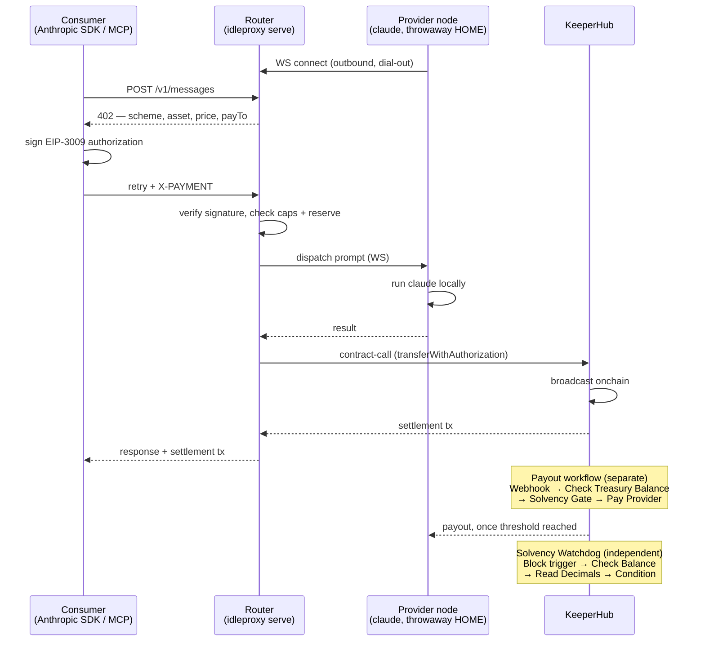

# IdleProxy

**Sell the hours your coding-agent subscription sits idle — settled onchain through [KeeperHub](https://keeperhub.com).**

Built for the KeeperHub "Agents Onchain" hackathon.

🔗 **Live**: [idleproxy-web.vercel.app](https://idleproxy-web.vercel.app) · **Router**: `router.valanamal.xyz` · **Proof**: real settlement tx [`0x827bb3dc...`](https://sepolia.basescan.org/tx/0x827bb3dc1c2d91a7c070e72e02f6585cf4dc6cf34976ead6b88e3729e03b9413)

---

## The problem

Every Claude Code subscription is billed flat but used in bursts. You pay for peak capacity; the other twenty-plus hours a day it just evaporates — unused, unpaid-for, non-transferable.

Meanwhile, agents and scripts that want a single coding-model call have no honest way to get one. No subscription, no API key to provision, no middleman to trust with a card — just a call, priced for what it costs, paid the instant it happens.

Two sides of the same wasted market, and nothing connecting them.

## The solution

IdleProxy is the metering and settlement rail between them. A provider runs one command on the machine they're already logged into `claude` on. Their OAuth credential is never read, parsed, or transmitted — a throwaway copy runs the binary, nothing leaves the machine. A consumer points an unmodified Anthropic SDK at the router and pays per call in USDC via x402, on Base Sepolia.

Every dollar in and every dollar out moves through KeeperHub — a real onchain `transferWithAuthorization`, verified locally and broadcast by KeeperHub itself, and a real KeeperHub payout workflow that settles the provider out. The router never holds a signing key for the treasury.

**Relaying your own subscription like this likely violates your provider's resale terms.** That's disclosed to every provider before they connect, not buried. This proves the rail is buildable safely and transparently; it doesn't resolve the policy question, and doesn't pretend to.

## How it works



The **treasurer** is a real Claude Code agent with the KeeperHub MCP server attached — it calls `execute_workflow` + `get_execution` to run payouts, not a cron job pretending to be one.

## KeeperHub surfaces used

| Surface | Where |
|---|---|
| `POST /api/execute/contract-call` | x402 settlement — verify locally, settle via KeeperHub, so no transaction touches the chain outside it |
| Payout workflow (Webhook → `web3/check-token-balance` → Condition → `web3/transfer-token`) | Provider payouts — solvency check and transfer live in KeeperHub, not application code |
| Solvency Watchdog workflow (Block trigger → `web3/check-token-balance` → `web3/read-contract` → Condition) | Independent treasury monitoring |
| `GET /workflows/{id}/executions` | Pulled into `GET /api/audit` as the reconciliation alert surface (see note below) |
| MCP server, `kh_` header auth | The treasurer's hands — `execute_workflow`, `get_execution` |
| Gas Station sponsorship | Every settlement and payout is gasless for the org wallet |

**A confirmed platform limit, not an oversight:** `webhook/send-webhook`, the system `HTTP Request`
action, and `code/run-code` all return `upgrade_required` on this org's tier — tested directly, all
three. No KeeperHub action can make an outbound HTTP call on this plan, which is why the Solvency
Watchdog's "alert" is KeeperHub's own Executions API rather than a push notification, and why the
settlement-scheduling hook is driven by `idleproxy treasurer` rather than a KeeperHub Schedule
trigger.

## Try it right now

- **Pay for a call, no setup**: [idleproxy-web.vercel.app/try](https://idleproxy-web.vercel.app/try) — connect a wallet holding test USDC, write a prompt, watch the x402 handshake happen live, get a real response with a Basescan link to the transaction that paid for it.
- **Become a provider**: [idleproxy-web.vercel.app](https://idleproxy-web.vercel.app) — connect wallet → accept disclosure → set caps → copy one `npx idleproxy node ...` command → run it on the machine you're logged into `claude` on. A fresh wallet reaches an earning node in under a minute.

## Install — contribute your idle Claude capacity

No clone, no build, no config file. Just `npx` and a `claude` login already on your machine:

1. Open [the hosted instance](https://idleproxy-web.vercel.app) (or `http://localhost:8787` if [running your own](#run-it-yourself)).
2. Click **Connect wallet** and sign the sign-in message. Any injected wallet (MetaMask, Coinbase
   Wallet, etc.) or Privy's email flow works.
3. Read and check the disclosure box. Also check the Tier 1 box if you want to opt into the
   containerized, tool-enabled tier (needs Docker on your machine) — otherwise the default tool-free
   tier is fine.
4. Set your caps (daily USD cap, daily request cap, max concurrency, reserve fraction) and click
   **Get node command**.
5. Copy the generated command and run it in a terminal on the machine you're already logged into
   `claude` on:
   ```bash
   npx idleproxy node --wallet=0x... --token=... --daily-usd-cap=5 --daily-request-cap=500 --max-concurrency=1 --reserve-fraction=0.2
   ```
   `npx` fetches the CLI on demand — nothing to install ahead of time. Add `--tier1` to the command
   yourself if you checked the Tier 1 box.
6. That's it — the node shows **online** on `/dashboard`, where you can watch accrued balance, job
   history, and payout history live, and hit **Kill switch** any time to stop earning.

The OAuth token in your `claude` login is never read, parsed, or transmitted — a copy of the credential file is dropped into a throwaway `HOME` and the binary is started there.

## Run it yourself

```bash
git clone <this repo> && cd idleproxy
npm install
cp .env.example .env   # fill in KEEPERHUB_API_KEY, KEEPERHUB_PAYOUT_WORKFLOW_ID
npx tsx src/cli.ts doctor    # checks claude, docker, KeeperHub, chain — all before you connect anything
npx tsx src/cli.ts serve     # router, on :8787 by default (pure API + WS, no UI served)
```

The provider/consumer dashboard is a separate Next.js app in `web/` — `cd web && npm install && npm
run dev` with `NEXT_PUBLIC_ROUTER_URL` pointed at your router. Talk to the router directly with `curl` if you'd
rather skip the UI entirely — see below.

```bash
curl -X POST http://localhost:8787/v1/messages \
  -H "Content-Type: application/json" \
  -d '{"model":"claude-code/sonnet","max_tokens":100,"messages":[{"role":"user","content":"hi"}]}'
# -> 402 with an x402 challenge; sign an EIP-3009 TransferWithAuthorization and retry with X-PAYMENT
```

Or skip per-call signing: `POST /api/keys` with an x402 payment mints an `ipx_sk_...` key with full
credit, then `x-api-key: ipx_sk_...` on `/v1/messages` never 402s — the path where "change one
environment variable and your existing SDK works" is literally true. `/v1/chat/completions` (OpenAI
shape) and `/mcp` (one tool, `relay_prompt`) are thin translators over the same settlement path.

## Mainnet

One env var. `CHAIN_ID`/`USDC_ADDRESS`/`EXPLORER_BASE` are read at boot; the EIP-712 domain
`name`/`version` are read live off the USDC contract, never hardcoded — the two chains' USDC
deployments don't share a domain, which is exactly why. Nothing in the source contains `84532` as a
literal. Deliberately not flipped for this submission: real money plus disclosed ToS exposure isn't a
hackathon posture.

## What honestly cannot work

Stated plainly:

- **Real economic value.** Testnet units are worthless. This proves a mechanism, not an economy.
- **Model-identity proof.** Without a TEE, a provider's self-reported model is a signed claim, not
  cryptographic proof.
- **Prompt confidentiality.** The provider's machine sees plaintext to run the CLI. No fix at this
  architecture.
- **Upstream compliance.** Reselling subscription capacity is squarely what most providers' terms
  target. Testnet play-money and the provider running their own binary reduce exposure; they don't
  make this clearly compliant.

## Monolith

The backend is one `package.json`, one `tsconfig.json`, one SQLite file. Router, provider node,
treasurer, and the bounty demo are subcommands of one binary
(`idleproxy serve | node | treasurer | doctor | facilitator-demo`) — it serves no HTML, pure API +
WebSocket. The dashboard UI in `web/` is deliberately a separate deployable (own `package.json`,
Next.js build step) so it can be hosted anywhere and talk to any router over its REST API.

## Bounty: being your own x402 facilitator

```bash
npx tsx src/cli.ts facilitator-demo
```

Zero funding, zero setup: generates a throwaway wallet, signs a zero-value EIP-3009 authorization,
settles it through KeeperHub, prints a real transaction link.
